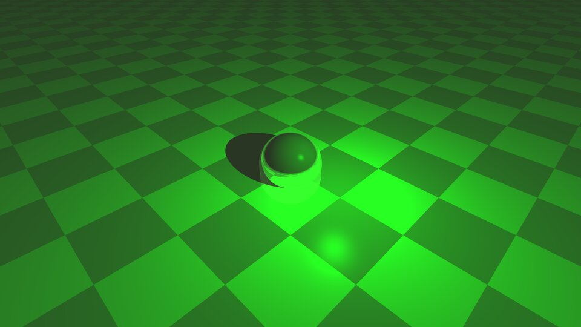

# raytracer

Рекурсивный ray tracer на C++ с нуля: без сторонних графических или математических библиотек, только Win32 API для окна и вывода кадра.

<p align="center">
  
  
</p>
<p align="center">
  
</p>

## Что реализовано

- **Рекурсивная трассировка лучей** (модель Уиттеда) с настраиваемой глубиной рекурсии и порогом отсечения по вкладу луча в итоговый цвет.
- **Примитивы**: сфера, плоскость, бокс, треугольник, произвольная квадрика — и **CSG** (объединение, пересечение, вычитание примитивов).
- **Освещение**: точечные и направленные источники с коэффициентами затухания (constant / linear / quadratic).
- **Материалы по модели Фонга** (Ka/Kd/Ks + показатель зеркальности) с библиотекой из 20 физических пресетов (золото, хром, серебро, рубин, нефрит, обсидиан и др.), плюс отдельные коэффициенты отражения и преломления для вторичных лучей.
- **Преломление с учётом среды** — трассировщик несёт показатель преломления и коэффициент поглощения текущей среды (воздух/стекло) через цепочку отражений.
- **Процедурные модификаторы поверхности** (например, шахматная текстура на плоскости).
- **Многопоточный рендер**: кадр строится параллельно несколькими потоками с потокобезопасным доступом к фреймбуферу; окно показывает прогресс рендера в реальном времени.
- Автосохранение готового кадра в `.tga` по завершении рендера.

## Сборка

Проект нативный под Windows (Win32 API, MSVC).

1. Открыть `T05RT.sln` в Visual Studio 2019+.
2. Собрать конфигурацию Release/x64.
3. Сцена собирается прямо в коде — примитивы, материалы и источники света добавляются в `scene` через `operator<<` (см. `src/main.cpp`).

## Структура

```
src/
  mth/     — векторная/матричная математика, камера, лучи (написаны с нуля)
  rt/
    shapes/  — sphere, box, plane, triangle, quadric, csg
    lights/  — точечный и направленный источники, материалы, среды
    frame.h  — потокобезопасный фреймбуфер
    rt_win.* — окно, многопоточный рендер-цикл
  win/     — обвязка Win32-окна
```

## Контекст

Сделан летом 2024 года на летней школе **CGSG** (Computer Graphics Support Group) физматлицея №30 — один из самых объёмных и требовательных по математике личных проектов: от вывода формул пересечений и преломления до синхронизации рендер-потоков.
